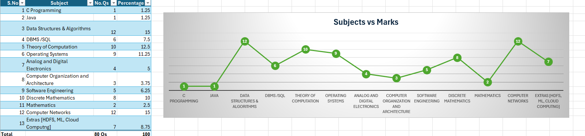

# ISRO Scientist 

## Computer Science Engineering Syllabus & Most IMP Topics 

## C/C++ Programming [1]
- Pointers

## Java [1]
- JVM

## 📘 Data Structures and Algorithms [12]
- Arrays
- Linked Lists  
- Stacks  
- Queues  
    - Priority Queue
- Trees  
    - Traversal Techniques (Pre, post, inorder)
    - Binary Search Tree
- Graphs  
- Sorting Algorithms
    - Radix sort
    - Bubble sort
    - Merge sort
    - Quick sort
    -
- Searching Algorithms 
    - Floyds
    - Warshal 
    - Dijkstra
    - Kruskals
    - Bellman Ford 
- Hashing 
- Time Complexity
    - Asymptotic complexity
    - Worst Time complexity

- Heap Memory
- Evaluation of Prefix and Postfix expressions 

## 💻 Operating Systems [9]
- Process Management 
    - Synchronization mechanisms
- Memory Management  
- File Systems  
- Deadlocks  
- Virtual Memory  
- Scheduling Algorithms 
    - Schedulers
        - Long Term
        - Medium Term
        - Short Term 
- I/O Systems 
- Multithreading 
    - Linux OS multithreading model
- Segmentation Memory allocation
- Interrupts
- Producer and Consumer problem
- Bounded buffer problem
- Context switching 
- Virtualization
Booting

## 🗄️ Database Management Systems (DBMS) [6]
- Relational Model  
- SQL  
- Normalization 
    - Fifth Normal form 
- Acid Properties 
- ER Model  
- Transactions  
- Indexing  
- Concurrency Control  

## 🌐 Computer Networks [12]
- OSI Model  
- TCP/IP  
- Routing Algorithms  
- IPv4/IPv6  
- Network Topologies  
- Protocols  
- Error Detection and Correction 
- TCP Flow Control & Sliding Window Protocol
    ## 1. TCP Basics
    - TCP vs UDP
    - TCP segment structure
    - Connection establishment (3-way handshake)
    - Connection teardown

    ## 2. Flow Control
    - Purpose of flow control in TCP
    - **Sliding Window Protocol**
    - Sender & receiver windows
    - Sequence numbers
    - Acknowledgments (ACKs)
    - Go-Back-N vs Selective Repeat (for understanding)

    ## 3. Congestion Control (Overview)
    - Difference between congestion and flow control
    - TCP congestion window (CWND)
    - Slow Start, Congestion Avoidance
    - (Optional for basic window size calculation but helpful for interviews)

    ## 4. Performance Metrics
    - **Bandwidth-Delay Product (BDP)**
    - Concept of "bits in flight"
    - Relation to window size
    - **Throughput**
    - Throughput vs link capacity
    - **Utilization**
    - Channel utilization calculation
    - Impact of RTT, bandwidth, and packet size

    ## 5. Window Size Calculations
    - Window size for 100% utilization:  
    `Window Size (in bits) = Bandwidth × RTT`
    - Convert to **bytes/packets** depending on the context
    - Adjust window size for target utilization (e.g., > 96%)
- CSMA / CD
- Versions of 802.11 
- Parity and Cyclic redundancy check
- Checksum [XOR, CRC]
- ICMP
- NAT Addressing
- ARP SPOOFING
- MAC Cloning
- Firewalls
- Asymmetrics Encrption

## Analog and Digital Electronics [5]
- Multiplexers
- Logic Gates (3)
- Adders

    

## 🧑‍💻 Software Engineering [5]
- Software Development Life Cycle (SDLC)  
- Software Design Patterns  
- Testing  
    - Types
    - MCDC Software testing technique
    - Regression Testing
- Maintenance  
- Agile Methodology  
- Diagrams 
    - HIPO Diagram
    - UML Diagram

## 🔢 Discrete Mathematics [8]
- Set Theory  
- Logic  
    - First order logic
- Relations  
- Functions  
- Graph Theory
    - Minimum spanning Tree
    - Simple Graphs
    - Different type of graphs
    - Undirected planar graph
    - McCabe’s cyclomatic complexity
- Combinatorics
- Probability

## Mathematics [2]
- Minimum number of arithmetics operations [X]
- Determinants 

## Automata Theory [10]
- Languages
- NFA
- CFG
- How compiler works 
- Parsing Techniques [LL(1)]
- DFA

## Computer Organization and Architecture [3]
- Different type of Computer Architecture                      
- Registers
    - 8 bit Serial registers

## Extras [7]
- HDFS
- Machine Learning
    - K-Means Algorithm (Which type of technique is it?)
- Cassandra 
    - Which type of data storage system is Cassandra??
- Cloud Computing
    - Temporarily renting 
- CAPTCHA In Webpages
- Cookies (this time i can expect question on this??)

                     

